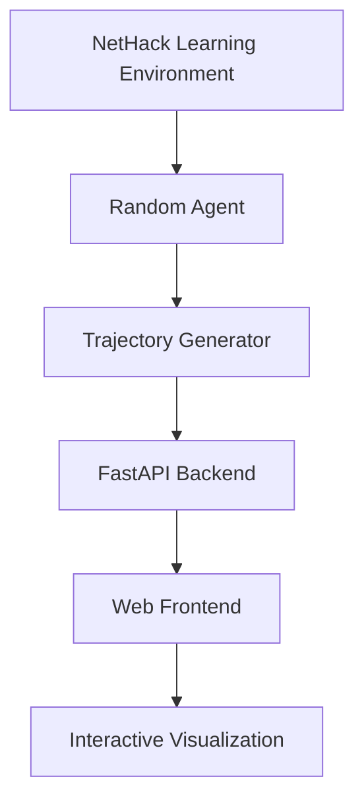

# NetHack Agent Viewer 🏰

[](https://python.org)
[](https://fastapi.tiangolo.com)
[](https://github.com/NetHack-LE/nle)
[](LICENSE)

An interactive webapp for visualizing and stepping through AI agent moves in the NetHack Learning Environment (NLE).


## ✨ Features

- 🎮 **Interactive Game Viewer**: Step through an agent's NetHack gameplay move by move
- 🤖 **AI Agent Integration**: Generate new trajectories with a simple random agent  
- 📊 **Detailed Stats**: View game statistics, rewards, and action information
- ⏯️ **Playback Controls**: Play, pause, skip, and navigate through game steps
- 🎯 **Multiple Environments**: Support for NetHackScore, NetHackStaircase, NetHackOracle
- 📁 **Trajectory Management**: Load and save game trajectories
- ⌨️ **Keyboard Shortcuts**: Arrow keys, Space bar, R for reset
- 🎨 **Terminal Theme**: Authentic NetHack ASCII aesthetic
- 🚀 **Trajectory Branching**: Continue generating moves from any point in the game

## 🚀 Quick Start

### Prerequisites

- Python 3.10+
- Git
- Build tools: `sudo apt-get install build-essential cmake ninja-build flex bison`

### Installation

1. **Clone this repository**:
   ```bash
   git clone https://github.com/lukas/nle-test.git
   cd nle-test
   ```

2. **Set up NetHack Learning Environment**:
   ```bash
   git clone https://github.com/NetHack-LE/nle.git
   cd nle
   git submodule update --init --recursive
   
   # Create virtual environment
   python3 -m venv nle-venv
   source nle-venv/bin/activate
   
   # Install NLE and webapp dependencies
   pip install -e .
   pip install fastapi uvicorn jinja2 python-multipart
   cd ..
   ```

3. **Create NetHack data link**:
   ```bash
   ln -sf nle/nle/nethackdir nle/nethackdir
   ```

4. **Run the webapp**:
   ```bash
   cd nle
   source nle-venv/bin/activate
   cd ..
   python app.py
   ```

5. **Open in browser**: Navigate to `http://localhost:8000`

## 🎯 Usage

### Web Interface Controls

| Control | Action |
|---------|--------|
| `←` `→` | Navigate steps manually |
| `Space` | Play/Pause auto-playback |
| `R` | Reset to beginning |
| Mouse | Click navigation buttons |

### Generating Trajectories

1. **Set Parameters**:
   - Number of steps (1-1000)
   - Random seed for reproducibility  
   - NetHack environment type

2. **Watch Agent Play**: 
   - See ASCII game screen
   - Read game messages
   - Track statistics and rewards
   - Observe action decisions

## 🏗️ Architecture



## 📁 Project Structure

```
nle-test/
├── app.py                 # FastAPI web application
├── simple_agent.py        # Random agent implementation
├── templates/
│   └── index.html         # Web interface
├── game_trajectory.json   # Sample trajectory data
├── requirements.txt       # Python dependencies
└── README.md             # This file
```

## 🔧 API Endpoints

| Endpoint | Method | Description |
|----------|--------|-------------|
| `/` | GET | Main web interface |
| `/generate` | POST | Generate new trajectory |
| `/trajectories` | GET | List available trajectories |
| `/trajectory/{id}` | GET | Get specific trajectory |
| `/trajectory/{id}/step/{step}` | GET | Get specific step |
| `/live-generate` | GET | Generate and return trajectory |

## 🐛 Troubleshooting

<details>
<summary>Common Issues</summary>

### "Couldn't find NetHack installation"
```bash
ln -sf nle/nle/nethackdir nle/nethackdir
```

### Build failures
```bash
sudo apt-get install build-essential cmake ninja-build flex bison
cd nle && git submodule update --init --recursive
```

### Import errors
```bash
source nle/nle-venv/bin/activate
pip install -r requirements.txt
```

</details>

## 🤝 Contributing

1. Fork the repository
2. Create a feature branch (`git checkout -b feature/amazing-feature`)
3. Commit your changes (`git commit -m 'Add amazing feature'`)
4. Push to the branch (`git push origin feature/amazing-feature`)
5. Open a Pull Request

## 📈 Roadmap

- [ ] Add more sophisticated agents (PPO, A3C, etc.)
- [ ] Real-time WebSocket gameplay streaming
- [ ] Advanced game state analysis tools
- [ ] Multi-agent comparison views
- [ ] Training progress visualization
- [ ] Export trajectories to video

## 📄 License

This project is licensed under the MIT License - see the [LICENSE](LICENSE) file for details.

## 🙏 Acknowledgments

- [NetHack Learning Environment](https://github.com/NetHack-LE/nle) - The underlying RL environment
- [NetHack Dev Team](https://www.nethack.org/) - The original game
- [FastAPI](https://fastapi.tiangolo.com/) - Modern web framework
- [Claude Code](https://claude.ai/code) - AI pair programming assistant

## 🔗 Links

- **Live Demo**: [Coming Soon]
- **Documentation**: [API Docs](http://localhost:8000/docs) (when running locally)
- **Issues**: [GitHub Issues](https://github.com/lukas/nle-test/issues)
- **NetHack Wiki**: [nethackwiki.com](https://nethackwiki.com)